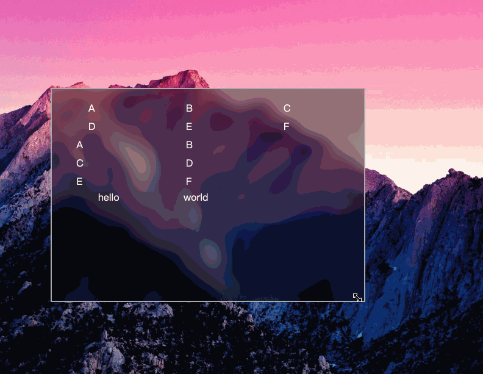
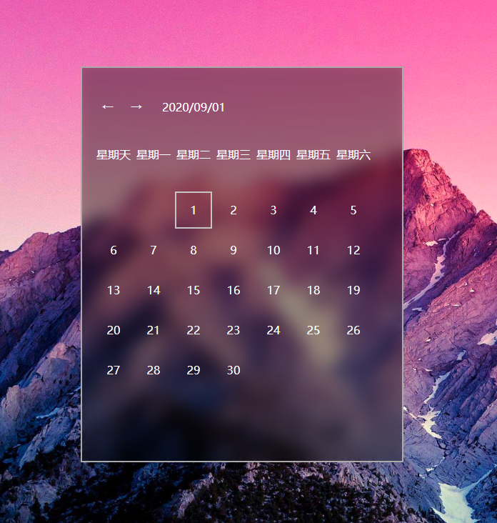

# fluent-design
尝试在web前端实现流畅设计，持续开发中，诈尸式更新

## 部分特性
### 拖拽动态模糊

### 窗口尺寸改变

### reveal

### 响应式24栏栅格
支持xs,sm,md,lg,xl五种尺寸,断点尺寸响应window组件的宽度变化，而不是视口的宽度
[点这里看例子源码](./src/example/reactive-layout.vue)

## TODO
* 自动布局
* 连接动画
* 并行动画
* 视差动画
* 多材质支持
## 相对于uwp流畅设计的主要区别
* 没有噪声层
* 动态模糊，模糊的只是背景，看不出窗口的重叠情况
## 预览
* 通过右侧about的链接进入
## 例子
### 一个不够健壮的流畅设计风格计算器
[点这里看源码](./src/example/calculator.vue)

### 日历
[点这里看源码](./src/example/calendar.vue)

