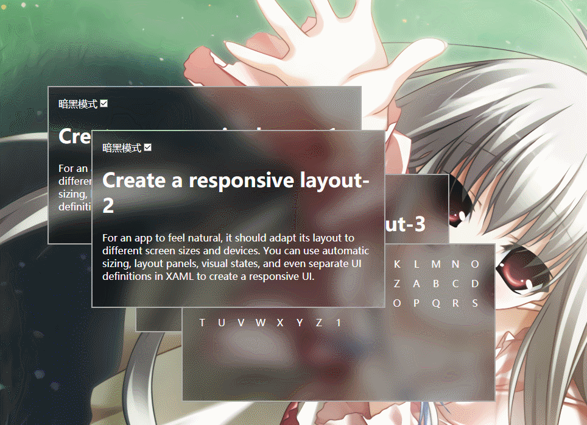
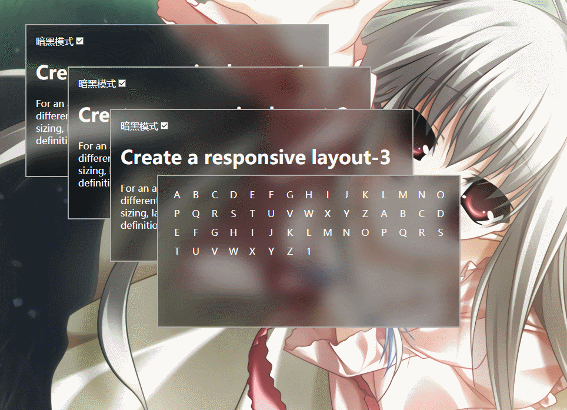
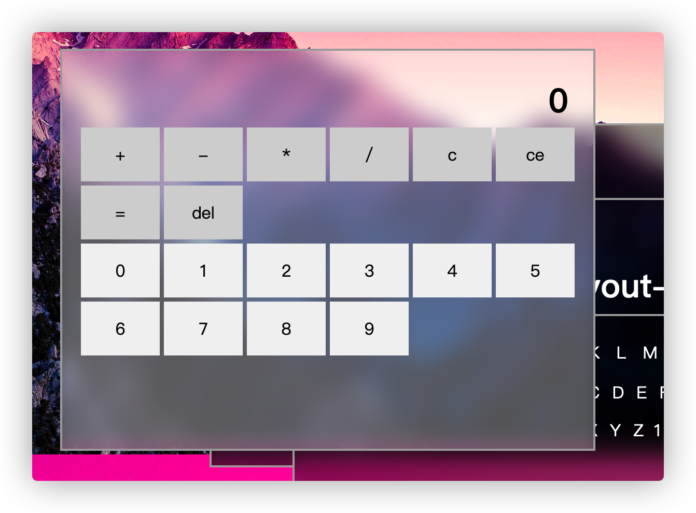

# fluent-design
尝试在web前端实现流畅设计，持续开发中，诈尸式更新

## 部分特性
### 拖拽动态模糊

### 窗口尺寸改变

### 探照灯?

## 相对于uwp流畅设计的主要区别
* 没有噪声层
* 动态模糊，模糊的只是背景，看不出窗口的重叠情况
## 预览
* 通过右侧about的链接进入
## 例子
### 一个不够健壮的流畅设计风格计算器
[点这里看源码](./src/components/calculator.vue)
